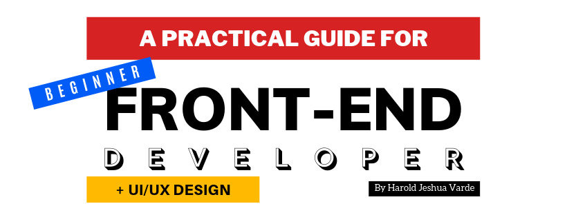

# **A PRACTICAL GUIDE FOR BEGINNER FRONTEND DEVELOPER _+ UI/UX DESIGN_**
## _by **Harold Jeshua Varde**_

### BASIC SOFTWARE & TOOLS
#### Text Editor
- VSCODE
- ATOM
- SUBLIME TEXT

### HTML & CSS
- Semantic HTML5 Elements
- Basic CSS
- Flexbox & CSS Grid
- CSS Variables
- Browser Dev Tools

### RESPONSIVE LAYOUT
- Set Viewport
- Fluid Widths
- Media Queries
- rem over px
- Mobile first, Stack Columns

### BASIC DEPLOYMENT
- Register Domain Name: Namecheap*, Google Domains
- Manage Shared Hosting or VPS: InMotion*, Hostgator, BlueHost
- FTP, SFTP File Upload: FileZilla, CyberDuck
- Static Hosting: Netlify*, Github Pages, Heroku,

### SASS PRE-PROCESSOR

### VANILLA JAVASCRIPT

### !!! BASIC FRONTEND DEVELOPER
- Build Static Websites
- Build UI Layouts
- Add Dynamic Functionality
- Deploy & Maintain Websites
- Gulp or Grunt
- Editor Extensions

### FRONTEND FRAMEWORKS
- React
- Vue
- Angular
- Svelte

### STATE MANAGEMENT
- Redux / Context API
- Apollo (GraphQL)
- VueX
- NgRx

### !!! FULL FLEDGED FRONTEND DEVELOPER
- Build Incredible Frontend Apps
- Smooth & Steady Frontend Flow
- Work well w/ Teams & Git
- Connect to Backend APIs

### + MOBILE DEV
- React Native: Build native apps with React
- NativeScript: Angular/Typescript/Javascript
- Ionic: Hybrid App with HTML/CSS/JS
- Flutter: MobileSDK for Android & iOS
- Xamarin: Mobile Apps with C#

### + YEARLY TRENDS
- GraphQL & Apollo
- Typescript
- Serverless Architecture
- AI & Machine Learning
- Blockchain Tech
- Progressive Web Apps (PWA):
    - Responsive
    - App-like Interactions
    - Service Workers (Offline | HTTPS)
- Web Assembly
    - Faster than JS
    - Secure
    - Open & Debuggable
- Voice UI

---

### + UI/UX DESIGN & DESIGN PRINCIPLES
#### Learn UI/UX
  What is UI Design?
  > User Interface (UI) Design, is the design of the look and feel of an application or website.

  What is UX Design?
  >User Experience (UX) Design, is the design of how a User will interact with your product in the most efficient way possible.

  How do they work together?
  _Image to be posted soon_

#### Learn Design Principles
  - Color: _Vocabulary, fundamentals and psychology of colors_
  - Line: _Width, length, direction, focus and feeling_
  - Balance: _Symmetry and assymetry_
  - Contrast: _Accessibility, for visually impaired, and focus_
  - Typography: _Choosing fonts and creating readable text_
  - Consistency: _Hierarchy, keeping all elements relatable_

#### Learn the UX Design Process
  _Image to be posted soon_
  - Understand
  - Research
  - Analyze *
  - Design *
  - Test *
  _(* - repeat)_

#### Develop an Eye for Design
  > Find design inspiration!
  - [Dribbble](https://dribbble.com/)
  - [Behance](https://www.behance.net/)
  - [Awwwards](https://www.awwwards.com/)
  - [Designspiration](https://www.designspiration.net/)
  - [The Best Designs](https://www.thebestdesigns.com/)

---

### Design Guide:
- LOGO
- COMPOSITION: Content / Components / Patterns
- TYPOGRAPHY
- ICONOGRAPHY
- COLOR
- MOTION
- PHOTOGRAPHY
- ILLUSTRATION
- TONE
- SOUND *

#### Design Type:
-   Flat Design
-   Material Design
-   Fluent Design

#### Frameworks
##### CSS:
-   Bootstrap
-   Materializecss
-   Bulma
-   Zurb Foundation
-   Skeleton

##### JS:
-   Angular
-   React
-   Vue
-   Aurelia

#### Animation
  - Animate.css
  - Bounce.js
  - AnimeJS
  - MagicAnimation
  - DynCSS
  - CSShake
  - HoverCSS
  - Velocity.js
  - AniJS

##### Content

**Backgrounds / Photos:**

-   Freepik
-   Pixabay
-   Pexels
-   Unsplash

**Colors:**

-   colorspace
-   coolhue
-   cssgradient.io
-   cssmatic
-   grabient

**Fonts:**

-   Google Fonts

**Icons:**

-   flaticon
-   icons8
-   fontawesome
-   linearicons
-   material.io

#### UI/UX Inspiration

-   Behance
-   CollectUI
-   dribbble
-   Flatun
-   Muzli
-   ...

#### Prototyping Tools:

-   InVision
-   Sketch
-   Webflow
-   Justinmind
-   Origami
-   UXPin
-   ...

---

## WEB DESIGN CHECKLIST 2019
### Responsive Logo
  - Portrait / Landscapre
  - Icon
  - Logo sizes: [xl*, lg, md, sm, xs*] _*not default_

### Colors
  - Primary Main
  - Primary Dark
  - Primary Light
  - Primary Gray
  - Secondary (...)
  - Alerts _(danger, warning, success, info)_
  - Custom

### Typography
#### Hierarchy
  - Display
  - Overline
  - Heading
    - _(h1- h6)_
  - Body
  - Title
  - Caption 
  
#### Font Choices
  - Font Main
  - Font Sans
  - Font Serif
  - Font Cursive
  - Font Mono
  - Font Custom

### Iconography
  - Icon Illustrations
  - Icon Font
    - _Symbols_

### Composition
#### Grid System
  - Grids
  - Rows
  - Columns
  - Gutters

#### Layout
  - Container
  - Level
  - Media Object
  - Hero
  - Section
  - Footer
  - Tiles

#### Forms
  - General
  - Input
  - Textarea
  - Select
  - Switch
  - Checkbox
  - Range
  - Radio
  - Picker
  - File

#### Elements
  - Alert
  - Badge
  - Box
  - Button
  - Content
  - Delete
  - Divider
  - Flag
  - Icon
  - Image
  - Label
  - List
  - Loader
  - Notification
  - Placeholder
  - Progress Bar
  - Table
  - Tag
  - Title
  - Tooltip
  - Segment

#### Components
  - Accordion
  - Breadcrumbs
  - Cards
  - Comments
  - Dimmer
  - Dropdown
  - Feed
  - Item
  - Menu
  - Message
  - Modal
  - Navbar
  - Pagination
  - Panel
  - Popup
  - Rating
  - Tabs
  - Search
  - Stats
  - Steps
  - Sticky
  - Transition